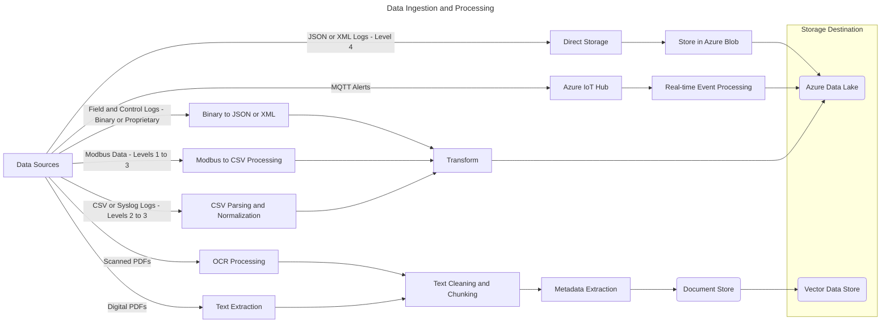
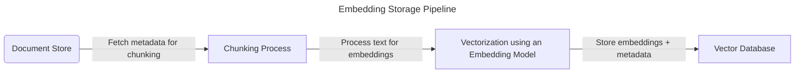
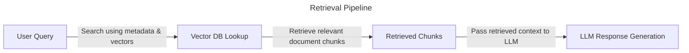

# AI-Buddy for Field Engineers

---

## Background Information

```text
We'll discuss your high-level approach to solving the following 
scenario: A global manufacturing client wants an AI-powered solution 
enabling field engineers to ask natural-language questions and retrieve 
relevant answers from unstructured PDFs, service logs, and manuals.
```

# Assumptions and Scope

## Assumptions

1. Let's assume that the manufacturing company manufactures industrial UPS. 
2. Let's also assume that this is a connected UPS, hence using industrial 
   reference architectures like [PERA](https://en.wikipedia.org/wiki/Purdue_Enterprise_Reference_Architecture). 
    - Industrial UPS systems support critical power backup for 
      control systems (PLCs, DCS, SCADA) at lower levels (PERA - process & field 
      control).
    - Logs exist at various PERA levels Field and Control (0-2) levels, Supervisory
      and Operational Level 3 and sometimes at EIT level (level 4)
    - The format of this data will vary from Binary/Proprietary at PERA levels 0-1, 
      _modbus_ at levels 1-3, _csv_ , _syslog_ format at PERA control levels (2-3), 
      JSON/XML at level 4. 

## Scope

1. Pipelines will need to constructed, de-duplicated and loaded into a 
   _Data Lake_.

   _This part is kept out of the scope of this document due to complexity._

## User Interaction
* Engineer wants to find out how to resolve the issue

```text
Q: Issue with product serno: X2378, Error message: UPS not charging

P: Query will execute a fetch from a knowledge document store based on 
   the query embedding. 

A: Perform the following troubleshooting activities , fetched from KB006, 
   on troubleshooting power issues.
    1. Check if power supply is available using a tester
    2. Check if the current reaches the transformer
    3. Check if the current reaches the rectifier
```

* Engineer wants to know what is wrong with the UPS

```text
Q: Error Code 5432, provide details

A: This is because of higher/incompatible power supply voltage, check if 
   voltage is 110 for US
```

---

# Approach and High Level Architecture

##  Approaches

This problem is very much amenable for an agentic architecture using tools for 
each type of query and actions, but since the requirement is basic and has only to 
do with query fetch, we will adopt a simple RAG architecture. Using agents 
makes the architecture far more complex. 

## High-Level Architecture

The system will be a Retrieval-Augmented Generation (RAG) based solution 

The system will need to fit into the larger context of the data architecture.

Data Management Layers

1. Data Ingestion
2. Data Processing Pipelines
2. Indexing and Retrieval
4. Response Generation


The technologies used will be as follows:
1. Large Language Models
2. Vector Embedding Storage and Search
3. Knowledge Graphs

---

# Data Ingestion

## Data Ingestion Segment

Each type of data needs to be handled separately, in an industrial setting this is
key for the success of the RAG system which we are doing the Architecture 
Development for.

1. OCR using tools like _Tesseract_ will be required for scanned pdfs
2. For processing tables libraries like _camelot_ are required
3. We may even need paid services like llamaparse for parsing pdf documents

The eventual destination of this stage is primarily a data lake. The secondary 
storage will be a vector database but that will happen later in the data 
processing pipelines. 

The metadata extracted from the pdf files provide very rich context for retrieval.
It is often used for filtering in the case of vector databases like _qdrant_.



--- 

## Indexing and Retrieval Segment

At this point the pdf files are in the _Azure Blob Storage_, the meta data extracted
in the previous segment is stored in a document database like _MongoDB_. 

### Generation and Storing of Embeddings

The next step is to compute the embeddings using an embedding model and upload it 
along with the meta-data into the vector database. 




At this point, all the components of the architecture is ready for 
use. 

### Symantic Search

The mechanism is as follows:
1. Query is input by the user
2. Query is converted into a _query embedding_, meta data is used at this stage to 
   either enrich the context or to perform filteration based on the meta data
3. The system uses similarity search for documents which march the query.
4. Documents (the number can be mentioned, e.g k = 1) will be returned ranked on 
   the basis of similarity




---

## Response Generation

The retrieved test in the above architectural segment provides context to the query 
made to the llm. 

The context is then dynamically substituted in a prompt and then dispatched to a 
llm. This results in a context-aware response which is then available to the user, 
which in our case is a service engineer.

### Post Processing

```mermaid
graph LR;
    UQ["User Query"] -->|Search using metadata & vectors| VDBLU["Vector DB Lookup"];
    VDBLU -->|Retrieve relevant document chunks| CHUNKS["Retrieved Chunks with Metadata"];
    CHUNKS -->|Pass retrieved context + metadata to LLM| LLM["LLM Response Generation"];
    LLM -->|Generate structured response with citations| RESPONSE["Final Response with Sources"];
    RESPONSE -->|Return answer with links & references| USR["User"];
```


This response can then be enriched or formatted in a way so as to make it more 
useful for the user

1. Summarization - The response then can then be sent to another model like 
   _Pegassus_  which can then provide very good summarization. In our case, this
   can be used to condense large documents to provide what is required and 
   necessarity for our service engineers

2. Citation - The easiest way to do this is to capture the metadata and 
   then use the metadata for citations. Advanced citation extractions can also be 
   done but it may be computationally intensive and may not add more value.


## Deployment Architecture

Once the development of the Data Management Layers - the data pipelines, the RAG pipeline 
which includes the vector store, the embedding generation and store services, the retrieval
services  and the response generation is complete. We have to look at the final deployment 
architecture to production.

### Front End

1. For the initial versions using _streamlit_ and _gradio_ is sufficient. This will ensure 
   rapid iteration and refinement from a end user perspective. 

2. Later versions will need working with UX professionals to ensure that the organization 
   design language is adhered to.

### The Service Layer

This will include the services connected in a service mesh with integrated observability

1. Every service which is exposed in the service layer will have apis (FastAPi) exposed. 
   Even driven architectures using kafka can also be used to increase decoupling
   between services and increase resilience. Some of the services which can be 
   connected to an event backbone will be 

   a. Document Ingestion Services - Since documents can come into the store at any time

   b. Embedding service and vector store updater services

   c. Services which subscribe to MQTT messages from field devices 
      (UPS and Related edge components)
      _Further analysis maybe required to identify which services quality for integration 
      into an event driven backbone_

2. The services will be packed in a container and pushed into a container registry, and then
   deployed into a kubernetes cluster. 
   - Isolation in the form of namespaces is requiried for better structure

       a. *Ingestion* - Isolation of *data pipelines* 

       b. *Observability* stack (Prometheus, Grafana, Loki, Elastic Search etc.)

       c. *RAG* components 

       d. *Ingress* (NGINX)

       e. *Inference* - Depending on if the llm is local (Ollama) or cloud based

       f. Presentation Services (UI) 

   - Stateful sets for Qdrant, MongoDB, Kafka 
