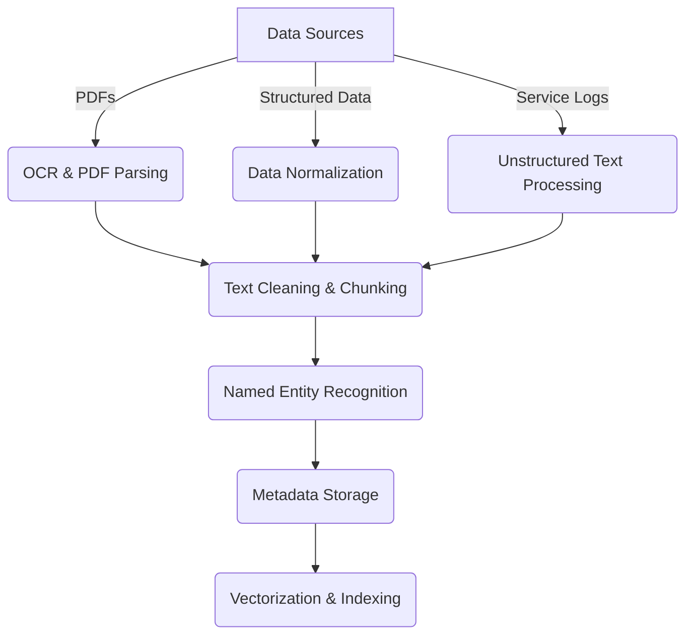

# AI-Buddy for Field Engineers

---

## Background Information

```text
We'll discuss your high-level approach to solving the following 
scenario: A global manufacturing client wants an AI-powered solution 
enabling field engineers to ask natural-language questions and retrieve 
relevant answers from unstructured PDFs, service logs, and manuals.
```

# Assumptions and Scope

## Assumptions

1. Let's assume that the manufacturing company manufactures industrial UPS. 
2. Let's also assume that this is a connected UPS, hence using industrial 
   reference architectures like [PERA](https://en.wikipedia.org/wiki/Purdue_Enterprise_Reference_Architecture). 
    - Industrial UPS systems support critical power backup for 
      control systems (PLCs, DCS, SCADA) at lower levels (PERA - process & field 
      control).
    - Logs exist at various PERA levels Field and Control (0-2) levels, Supervisory
      and Operational Level 3 and sometimes at EIT level (level 4)
    - The format of this data will vary from Binary/Proprietary at PERA levels 0-1, 
      _modbus_ at levels 1-3, _csv_ , _syslog_ format at PERA control levels (2-3), 
      JSON/XML at level 4. 

## Scope

1. Pipelines will need to constructed, de-duplicated and loaded into a 
   _Data Lake_. _This part is kept out of the scope of this document due 
   to complexity._

## User Interaction

* Engineer wants to find out how to resolve the issue

Q: Issue with product serno: X2378, Error message: UPS not charging

P: Query will execute a fetch from a knowledge document store based on 
   the query embedding. 

A: Perform the following troubleshooting activities , fetched from KB006, 
   on troubleshooting power issues.
    1. Check if power supply is available using a tester
    2. Check if the current reaches the transformer
    3. Check if the current reaches the rectifier

* Engineer wants to know what is wrong with the UPS

Q: Error Code 5432, provide details

A: This is because of higher/incompatible power supply voltage, check if 
   voltage is 110 for US

---

# Approach and High Level Architecture

##  Approaches

This problem is very much amenable for an agentic architecture using tools for 
each type of query and actions, but since the requirement is basic and has only to 
do with query fetch, we will adopt a simple RAG architecture. Using agents 
makes the architecture far more complex. 

## High-Level Architecture

The system will be a Retrieval-Augmented Generation (RAG) based solution 

The system will need to fit into the larger context of the data architecture.

Data Management Layers

1. Data Ingestion
2. Data Processing Pipelines
2. Indexing and Retrieval
4. Response Generation


The technologies used will be as follows:
1. Large Language Models
2. Vector Embedding Storage and Search
3. Knowledge Graphs

---

# Data Ingestion

## **Data Ingesting Segment - Mermaid Diagram**


--- 

